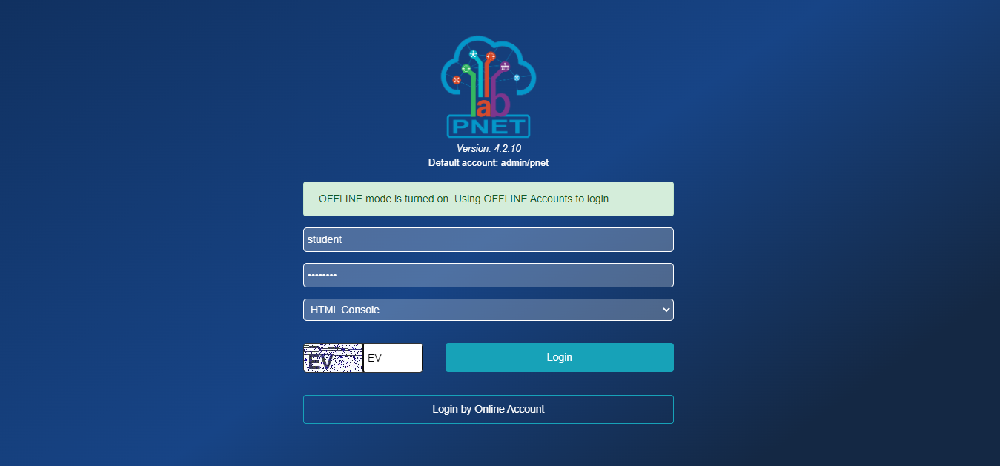
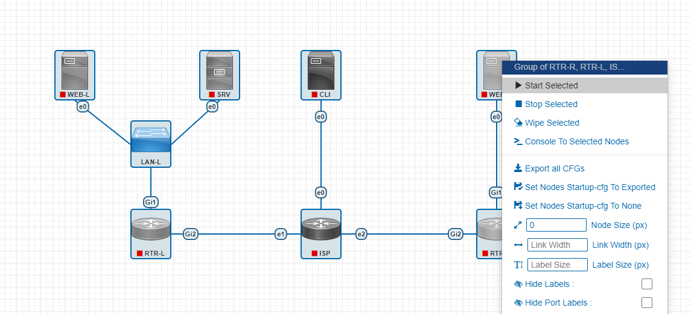
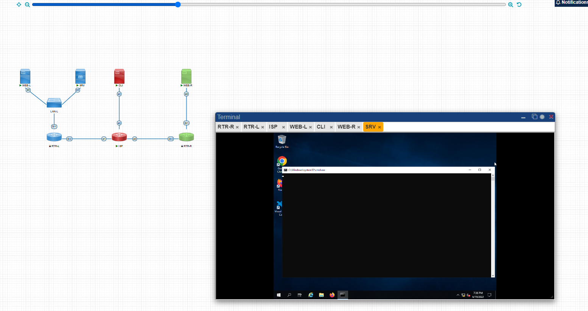


## Запуск лабораторной работы

Нажмите на кнопку ``Запланировать``. В ближайшее время планировщик запустит развертывание лабораторного окружения. Вы увидите планируемое время начала (фактическое время развертывания может отличаться). Когда лабораторное окружение будет развернуто, на адрес электронной почты, привязанный к вашему аккаунту, придет сообщение о готовности.

Сообщение о планируемом времени начала смениться на сообщение ``Лабораторная началась``, а также появится кнопка ``Открыть консоль``. При нажатии на нее, справа откроется панель с данными для входа на портал лабораторного окружения (PnetLab).

Используя учетные данные для входа на портал лабораторного окружения. При первом входе выберите опцию ``Offline mode``. При вводе учетных данных также выберите опцию ``HTML5 Console``.

В корневой директории вам будет доступна одна лабораторная работа. Выберите ее и нажмите кнопку ``Open`` под топологией. Выделите все виртуальные машины, нажмите правой клавишей мыши на любой из них и нажмите ``Start selected``.

Ползунок в верхней части рабочей области позволяет изменить масштаб топологии. После запуска виртуальных машин, при нажатии на иконку каждой машины, откроется HTML5-консоль в текущем окне. Консоль каждой виртуальной машины будет открываться в отдельной вкладке окна терминала. Для удобства рекомендуется развернуть окно  терминала с консолями в отдельную вкладку браузера (вторая кнопка в верхней правой части окна терминала).

При длительном отсутствии ввода, консоль может отключиться. При отсутствии отклика при вводе, закройте вкладку консоли устройства и нажмите на иконку виртуальной машины, чтобы открыть снова открыть консоль.

При необходимости вернуть одну или несколько машин к начальной конфигурации, необходимо вызвать контекстное меню, нажатием правой клавишей мыши по иконке виртуальной машине, нажать ``Stop``, после выключения виртуальной машины в контекстном меню нажать ``Wipe``, затем снова запустить виртуальную машину (``Start``).

## Топология

**Учетные записи по умолчанию**

- ВМ под управлением ОС Linux - root:toor
- ВМ под управлением ОС Windows - administrator:P@ssw0rd
- ВМ под управлением Cisco IOS - без учетной записи

---

**Примечание**

После включения, машины SRV, CLI И ISP перезагрузятся после применения начальной конфигурации при начальной загрузке.

---

## Виртуальные машины и коммутация

Необходимо выполнить создание и базовую конфигурацию виртуальных машин. 

- На основе предоставленных ВМ или шаблонов ВМ создайте отсутствующие виртуальные машины в соответствии со схемой. 

  - Характеристики ВМ установите в соответствии с **Таблицей 1**; 

  - Коммутацию (если таковая не выполнена) выполните в соответствии со схемой сети. 

- Имена хостов в созданных ВМ должны быть установлены в соответствии со схемой. 

- Адресация должна быть выполнена в соответствии с **Таблицей 1**; 

- Обеспечьте ВМ дополнительными дисками, если таковое необходимо в соответствии с **Таблицей 1**; 

## Сетевая связность

В рамках данного модуля требуется обеспечить сетевую связность между регионами работы приложения, а также обеспечить выход ВМ в имитируемую сеть “Интернет”. 

- Сети, подключенные к ISP, считаются внешними: 

  - Запрещено прямое попадание трафика из внутренних сетей во внешние и наоборот; 

- Платформы контроля трафика, установленные на границах регионов, должны выполнять трансляцию трафика, идущего из соответствующих внутренних сетей во внешние сети стенда и в сеть Интернет. 

  - Трансляция исходящих адресов производится в адрес платформы, расположенный во внешней сети. 

- Между платформами должен быть установлен защищенный туннель, позволяющий осуществлять связь между регионами с применением внутренних адресов. 

  - Трафик, проходящий по данному туннелю, должен быть защищен: 

    - Платформа ISP не должна иметь возможности просматривать содержимое пакетов, идущих из одной внутренней сети в другую. 

  - Туннель должен позволять защищенное взаимодействие между платформами управления трафиком по их внутренним адресам 

    - Взаимодействие по внешним адресам должно происходит без применения туннеля и шифрования. 

  - Трафик, идущий по туннелю между регионами по внутренним адресам, не должен транслироваться. 

- Платформа управления трафиком RTR-L выполняет контроль входящего трафика согласно следующим правилам: 

  - Разрешаются подключения к портам DNS, HTTP и HTTPS для всех клиентов; 

    - Порты необходимо для работы настраиваемых служб 

  - Разрешается работа выбранного протокола организации защищенной связи; 

    - Разрешение портов должно быть выполнено по принципу “необходимо и достаточно” 

  - Разрешается работа протоколов ICMP; 

  - Разрешается работа протокола SSH; 

  - Прочие подключения запрещены; 

  - Для обращений в платформам со стороны хостов, находящихся внутри регионов, ограничений быть не должно; 

- Платформа управления трафиком RTR-R выполняет контроль входящего трафика согласно следующим правилам: 

  - Разрешаются подключения к портам HTTP и HTTPS для всех клиентов; 

    - Порты необходимо для работы настраиваемых служб 

  - Разрешается работа выбранного протокола организации защищенной связи; 

    - Разрешение портов должно быть выполнено по принципу “необходимо и достаточно” 

  - Разрешается работа протоколов ICMP; 

  - Разрешается работа протокола SSH; 

  - Прочие подключения запрещены; 

  - Для обращений в платформам со стороны хостов, находящихся внутри регионов, ограничений быть не должно; 
  
- Обеспечьте настройку служб SSH региона Left: 

  - Подключения со стороны внешних сетей по протоколу к платформе управления трафиком RTR-L на порт 2222 должны быть перенаправлены на ВМ Web-L; 

  - Подключения со стороны внешних сетей по протоколу к платформе управления трафиком RTR-R на порт 2244 должны быть перенаправлены на ВМ Web-R; 

## Инфраструктурные службы

В рамках данного модуля необходимо настроить основные инфраструктурные службы и настроить представленные ВМ на применение этих служб для всех основных функций. 

- Выполните настройку первого уровня DNS-системы стенда:   
 
  - Используется ВМ ISP; 

  - Обслуживается зона demo.wsr. 

    - Наполнение зоны должно быть реализовано в соответствии с **Таблицей 2**; 

  - Сервер делегирует зону int.demo.wsr на SRV; 

    - Поскольку SRV находится во внутренней сети западного региона, делегирование происходит на внешний адрес маршрутизатора данного региона. 

    - Маршрутизатор региона должен транслировать соответствующие порты DNS-службы в порты сервера SRV. 

  - Внешний клиент CLI должен использовать DNS-службу, развернутую на ISP, по умолчанию; 

- Выполните настройку второго уровня DNS-системы стенда; 

  - Используется ВМ SRV; 

  - Обслуживается зона int.demo.wsr; 

    - Наполнение зоны должно быть реализовано в соответствии с **Таблицей 2**; 

  - Обслуживаются обратные зоны для внутренних адресов регионов 

    - Имена для разрешения обратных записей следует брать из **Таблицы 2**; 

- Сервер принимает рекурсивные запросы, исходящие от адресов внутренних регионов; 

    - Обслуживание клиентов(внешних и внутренних), обращающихся к зоне int.demo.wsr, должно производиться без каких-либо ограничений по адресу источника; 

  - Внутренние хосты регионов (равно как и платформы управления трафиком) должны использовать данную DNS-службу для разрешения всех запросов имен; 

- Выполните настройку первого уровня системы синхронизации времени:

  - Используется сервер ISP. 

  - Сервер считает собственный источник времени верным, stratum=4; 

  - Сервер допускает подключение только через внешний адрес соответствующей платформы управления трафиком; 

    - Подразумевается обращение SRV для синхронизации времени; 

  - Клиент CLI должен использовать службу времени ISP; 

- Выполните конфигурацию службы второго уровня времени на SRV.

  - Сервер синхронизирует время с хостом ISP; 

    - Синхронизация с другими источникам запрещена; 

  - Сервер должен допускать обращения внутренних хостов регионов, в том числе и платформ управления трафиком, для синхронизации времени; 

  - Все внутренние хосты(в том числе и платформы управления трафиком) должны синхронизировать свое время с SRV; 

- Реализуйте файловый SMB-сервер на базе SRV 

  - Сервер должен предоставлять доступ для обмена файлами серверам WEB-L и WEB-R; 

  - Сервер, в зависимости от ОС, использует следующие каталоги для хранения файлов: 

    - /mnt/storage для система на базе Linux; 

    - Диск R:\ для систем на базе Windows; 

  - Хранение файлов осуществляется на диске (смонтированном по указанным выше адресам), реализованном по технологии RAID типа “Зеркало”; 

- Сервера WEB-L и WEB-R должны использовать службу, настроенную на SRV, для обмена файлами между собой: 

  - Служба файлового обмена должна позволять монтирование в виде стандартного каталога Linux; 

    - Разделяемый каталог должен быть смонтирован по адресу /opt/share; 

  - Каталог должен позволять удалять и создавать файлы в нем для всех пользователей; 

- Выполните настройку центра сертификации на базе SRV: 

  - В случае применения решения на базе Linux используется центр сертификации типа OpenSSL и располагается по адресу /var/ca; 

  - Выдаваемые сертификаты должны иметь срок жизни не менее 500 дней; 

  - Параметры выдаваемых сертификатов: 

    - Страна RU; 

    - Организация DEMO.WSR; 

    - Прочие поля (за исключением CN) должны быть пусты; 

## Инфраструктура веб-приложения

Данный блок подразумевает установку и настройку доступа к веб-приложению, выполненному в формате контейнера Docker. 

- Образ Docker (содержащий веб-приложение) расположен на ISO-образе дополнительных материалов; 

  - Выполните установку приложения AppDocker0; 

- Пакеты для установки Docker расположены на дополнительном ISO-образе; 

- Инструкция по работе с приложением расположена на дополнительном ISO-образе; 

- Необходимо реализовать следующую инфраструктуру приложения.   
  
  - Клиентом приложения является CLI (браузер Edge); 

  - Хостинг приложения осуществляется на ВМ WEB-L и WEB-R; 

  - Доступ к приложению осуществляется по DNS-имени www.demo.wsr; 

    - Имя должно разрешаться во “внешние” адреса ВМ управления трафиком в обоих регионах; 

    - При необходимости, для доступа к к приложению допускается реализовать реверс-прокси или трансляцию портов; 

  - Доступ к приложению должен быть защищен с применением технологии TLS; 

    - Необходимо обеспечить корректное доверие сертификату сайта, без применения “исключений” и подобных механизмов; 

  - Незащищенное соединение должно переводиться на защищенный канал автоматически; 

- Необходимо обеспечить отказоустойчивость приложения; 

  - Сайт должен продолжать обслуживание (с задержкой не более 25 секунд) в следующих сценариях: 

    - Отказ одной из ВМ Web 

    - Отказ одной из ВМ управления трафиком. 

Таблица 1. Характеристики ВМ 

| Имя ВМ | ОС                  | IP-адреса          | Дополнительно         |
|--------|---------------------|--------------------|-----------------------|
| RTR-L  | Cisco CSR           | 4.4.4.100/24       |                       |
|        |                     | 192.168.100.254/24 |                       |
| RTR-R  | Cisco CSR           | 5.5.5.100/24       |                       |
|        |                     | 172.16.100.254/24  |                       |
| SRV    | Windows Server 2019 | 192.168.100.200/24 | Дополнительные диски: 2 шт по 2 Гб |
| WEB-L  | Debian 11           | 192.168.100.100/24 |                       |
| WEB-R  | Debian 11           | 172.16.100.100/24  |                       |
| ISP    | Debian 11           | 4.4.4.1/24         |                       |
|        |                     | 5.5.5.1/24         |                       |
|        |                     | 3.3.3.1/24         |                       |
| CLI    | Windows 10          | 3.3.3.10/24        |                       |

Таблица 2. DNS-записи зон 

| Зона         | Тип записи | Ключ     | Значение        |
|--------------|------------|----------|-----------------|
| demo.wsr     | A          | isp      | 3.3.3.1         |
|              | A          | www      | 4.4.4.100       |
|              | A          | www      | 5.5.5.100       |
|              | CNAME      | internet | isp             |
| int.demo.wsr | A          | web-l    | 192.168.100.100 |
|              | A          | web-r    | 172.16.100.100  |
|              | A          | srv      | 192.168.100.200 |
|              | A          | rtr-l    | 192.168.100.254 |
|              | A          | rtr-r    | 172.16.100.254  |
|              | CNAME      | ntp      | srv             |
|              | CNAME      | dns      | srv             |

